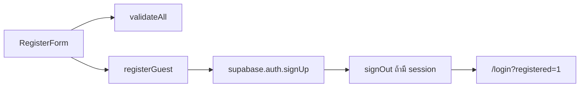

# แผน Auth: สมัครสมาชิก (branch + tests)

หน้าสมัครมีอยู่แล้วที่ [`src/components/auth/register-form.jsx`](src/components/auth/register-form.jsx) แต่ `validateField` / `validateAll` ยังเป็นฟังก์ชันใน component และไม่มี API Route (`/api/register` ไม่มี) เลยยังเทสแบบโปรเจกต์นี้ไม่ได้จนกว่าจะแยก logic ออกมาก่อน

## 1. แตก branch จาก origin/dev

อย่าทำบน `feat/log-in-admin` (คนละงาน)

```bash
git fetch origin
git checkout origin/dev
git checkout -b feat/auth-register
```

Commit ตาม Conventional Commits เช่น `feat(auth): extract register validation` แล้ว `test(auth): add register unit and integration tests`

## 2. แยก logic ให้เทสได้ (จำเป็นก่อนเขียนเทส)

ทำแบบเดียวกับคอร์ส: UI เรียกฟังก์ชันใน `src/lib/`

- สร้าง [`src/lib/register-validation.js`](src/lib/register-validation.js)
  - ย้าย `EMAIL_PATTERN`, `validateField`, `validateAll` ออกจากฟอร์ม
  - `education` ยังไม่บังคับ (คืน `""`)
  - วันเกิดห้ามเป็นอนาคต ตามโค้ดเดิม
- สร้าง [`src/lib/register-guest.js`](src/lib/register-guest.js)
  - ห่อ `supabase.auth.signUp` + ถ้ามี `data.session` ให้ `signOut`
  - ส่ง metadata: `full_name`, `date_of_birth`, `educational_background`
  - trim email / name / education ตามฟอร์มเดิม
- [`src/components/auth/register-form.jsx`](src/components/auth/register-form.jsx) เหลือแค่ UI แล้วเรียกสองไฟล์นี้



ไม่สร้าง API Route ใหม่ และไม่เพิ่ม jsdom / Testing Library เพราะ Vitest ตอนนี้อยู่ที่ `environment: "node"` และเทสที่มีอยู่เรียก handler / ฟังก์ชันล้วน ๆ

## 3. Unit test — validation อย่างเดียว

ไฟล์ใหม่: [`tests/unit/register-validation.test.js`](tests/unit/register-validation.test.js)

โปรเจกต์ยังไม่มีโฟลเดอร์ `tests/unit/` (เทส validation คอร์สอยู่ใน `tests/integration/` ทั้งที่เป็น unit) เริ่มโฟลเดอร์นี้เพื่อแยกให้ตรงกับที่ต้องส่ง

ครอบคลุมเคสจากชีท:

- ข้อมูลครบ → ไม่มี error
- education ว่าง → ผ่าน
- ว่างทั้งฟอร์ม → error ตามช่อง Name / DOB / Email / Password / Confirm และ education ไม่มี error
- email ผิดรูปแบบ
- password สั้นกว่า 6 ตัว
- confirm ไม่ตรง / ว่าง
- วันเกิดเป็นวันในอนาคต

ใช้ `vi.useFakeTimers()` ตอนเทสวันเกิดในอนาคต ไม่ยิงเครือข่าย

## 4. Integration test — ไหลสมัครกับ mock Supabase

ไฟล์ใหม่: [`tests/integration/register-guest.test.js`](tests/integration/register-guest.test.js)

แบบเดียวกับ [`tests/integration/create-course.test.js`](tests/integration/create-course.test.js): mock client แล้วเรียกฟังก์ชัน ไม่ยิง Supabase จริง

เคสหลัก:

- สมัครสำเร็จ → เรียก `signUp` ด้วย email ที่ trim แล้ว + metadata ถูกต้อง แล้ว `signOut` ถ้ามี session
- สมัครสำเร็จแบบไม่มี session → ไม่เรียก `signOut`
- อีเมลซ้ำ / Supabase error → คืน error message ไม่เรียก `signOut`
- ข้อมูลไม่ผ่าน validation → ไม่เรียก `signUp`

ไม่เทส React form, navbar, หรือหน้า `/login?registered=1` ในรอบนี้

## 5. สิ่งที่ไม่ทำใน branch นี้

- ไม่ใส่เทส login admin
- ไม่บังคับกรอก Educational Background
- ไม่เพิ่มกฎ password นอกจากยาวอย่างน้อย 6 ตัว
- ไม่ยิง API จริง และไม่เขียน E2E

## ลำดับลงมือ

1. แตก `feat/auth-register` จาก `origin/dev`
2. ย้าย validation + `registerGuest` ออกจากฟอร์ม
3. เขียน unit แล้วตามด้วย integration
4. รัน `npm test` ให้ผ่าน
