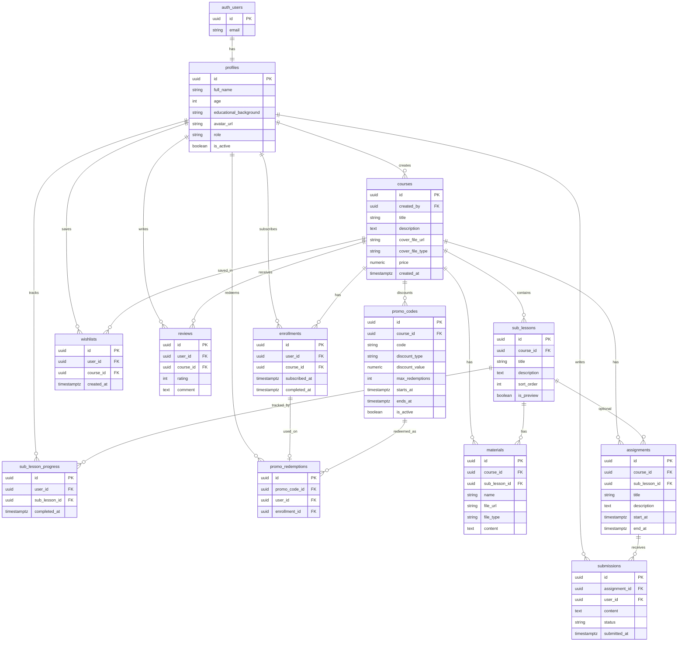

# CourseFlow database ERD

Normalized public schema on top of Supabase `auth.users`. Email and password stay in Auth; “change password” needs no extra table.

Out of scope: payments, bundles, extra course filters (type, subject), REST path list, SQL / RLS.

## Diagram

## Design rules

- `profiles.id` = `auth.users.id`.
- `profiles.role` is `student` | `admin`. `profiles.is_active` covers admin deactivation.
- Subscribe / unsubscribe is `enrollments`, not a flag on `courses`.
- Wishlist / “Will Learn” is `wishlists`, separate from enrollment. Saving a course does not subscribe the user.
- Course cover is a **file upload** to Storage, not an external URL. `cover_file_url` is the storage path; `cover_file_type` is `image` or `video`. Use one cover file per course (picture or video). Lesson PDFs/videos stay in `materials`.
- Course `price` is `numeric` (`0` = free) so promo discounts have something to apply to.
- Sub-lesson samples: `sub_lessons.is_preview`. Full sub-lesson content is gated by enrollment in app logic.
- `materials.content` holds text (or HTML) when the item is not a file. `file_url` / `file_type` stay for PDF, video, and images; unused columns stay null.
- Overdue assignment status is computed from `assignments.end_at`, not stored.
- Analytics are queries over enrollments / progress / submissions — no extra fact table.

## Cardinality

- One profile per auth user.
- A course has many sub-lessons. Materials always belong to a **course**, and optionally a **sub-lesson** (`sub_lesson_id` null = course-level file).
- Wishlist is unique `(user_id, course_id)`.
- Enrollment is unique `(user_id, course_id)`. `completed_at` is set when all sub-lessons are done — that unlocks reviews.
- Submission is unique `(assignment_id, user_id)`. `status` is `in_progress` | `submitted`.
- Progress is unique `(user_id, sub_lesson_id)`. Course % = completed sub-lessons / total sub-lessons.
- Review is unique `(user_id, course_id)`.
- Promo `course_id` null = applies to any course. One redemption row per use, tied to the enrollment it discounted.
