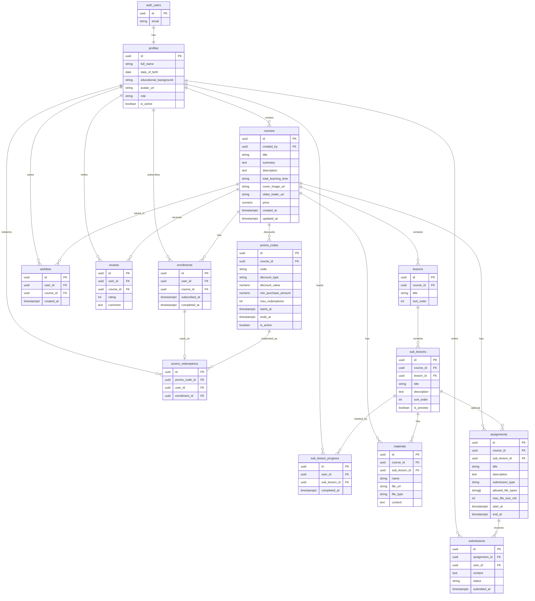

# CourseFlow database ERD

Normalized public schema on top of Supabase `auth.users`. Email and password stay in Auth; “change password” needs no extra table.

Out of scope: payments, bundles, extra course filters (type, subject), REST path list, SQL / RLS.

## Diagram

## Form ↔ tables (Add Course)

| Add Course form field | Table.column |
| --------------------- | ------------ |
| Course name | `courses.title` |
| Course summary | `courses.summary` |
| Course detail | `courses.description` |
| Price | `courses.price` |
| Total learning time | `courses.total_learning_time` |
| Cover image | `courses.cover_image_url` (Storage path) |
| Video trailer | `courses.video_trailer_url` (Storage path) |
| Attach file (optional) | `materials` row with `course_id` set, `sub_lesson_id` null |
| Promo code / min purchase / discount | `promo_codes` (`code`, `min_purchase_amount`, `discount_type` `thb`\|`percent`, `discount_value`) |
| Lesson name + drag order | `lessons.title`, `lessons.sort_order` |

Sub-lesson **count** in the UI is derived from child `sub_lessons` rows (not stored on `lessons`). Creating a course from today’s UI inserts lesson rows only; sub-lessons are added later via a sub-lesson editor.

## Form ↔ tables (Add Assignment)

| Add Assignment form field | Table.column |
| ------------------------- | ------------ |
| Course | `assignments.course_id` |
| Lesson | used to pick a sub-lesson; not stored |
| Sub-lesson | `assignments.sub_lesson_id` |
| Assignment | `assignments.title` |
| Description (optional) | `assignments.description` |
| Submission | `assignments.submission_type` (`text` \| `file` \| `url`) |
| Allowed files | `assignments.allowed_file_types` (`pdf`, `doc`, `image`; null unless `file`) |
| Max file size | `assignments.max_file_size_mb` (5 / 10 / 20 / 50; null unless `file`) |

A sub-lesson may have many assignments. `start_at` and `end_at` stay unused by this form.

## Design rules

- `profiles.id` = `auth.users.id`.
- `profiles.role` is `student` | `admin`. `profiles.is_active` covers admin deactivation.
- Subscribe / unsubscribe is `enrollments`, not a flag on `courses`.
- Wishlist / “Will Learn” is `wishlists`, separate from enrollment. Saving a course does not subscribe the user.
- Cover image and video trailer are **separate required file uploads** to Storage. `cover_image_url` and `video_trailer_url` store storage paths (not external URLs).
- Optional course attachment is a course-level `materials` row (`sub_lesson_id` null). Lesson PDFs/videos stay in `materials` (optionally linked to a `sub_lesson_id`).
- Course `price` is `numeric` (`0` = free) so promo discounts have something to apply to.
- Promo `discount_type` is `thb` | `percent`. `min_purchase_amount` defaults to `0`. `max_redemptions` / `starts_at` / `ends_at` may be null when not collected by the form.
- A course has many **lessons**; each lesson has many **sub_lessons**. `sub_lessons.course_id` is kept for convenient course-scoped queries.
- Sub-lesson samples: `sub_lessons.is_preview`. Full sub-lesson content is gated by enrollment in app logic.
- `materials.content` holds text (or HTML) when the item is not a file. `file_url` / `file_type` stay for PDF, video, and images; unused columns stay null.
- Assignment `submission_type` is `text` | `file` | `url`. `allowed_file_types` (`pdf`, `doc`, `image`) and `max_file_size_mb` (5 / 10 / 20 / 50) are set only for `file`; otherwise both stay null. A sub-lesson may have many assignments.
- Overdue assignment status is computed from `assignments.end_at`, not stored. The Add Assignment form does not set `start_at` or `end_at`.
- Analytics are queries over enrollments / progress / submissions — no extra fact table.

## Cardinality

- One profile per auth user.
- A course has many lessons; a lesson has many sub-lessons. Materials always belong to a **course**, and optionally a **sub-lesson** (`sub_lesson_id` null = course-level file).
- Wishlist is unique `(user_id, course_id)`.
- Enrollment is unique `(user_id, course_id)`. `completed_at` is set when all sub-lessons are done — that unlocks reviews.
- Submission is unique `(assignment_id, user_id)`. `status` is `in_progress` | `submitted`.
- Progress is unique `(user_id, sub_lesson_id)`. Course % = completed sub-lessons / total sub-lessons.
- Review is unique `(user_id, course_id)`.
- Promo `course_id` null = applies to any course. One redemption row per use, tied to the enrollment it discounted.
